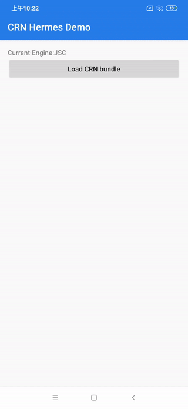
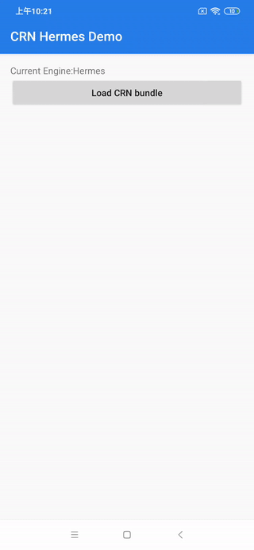
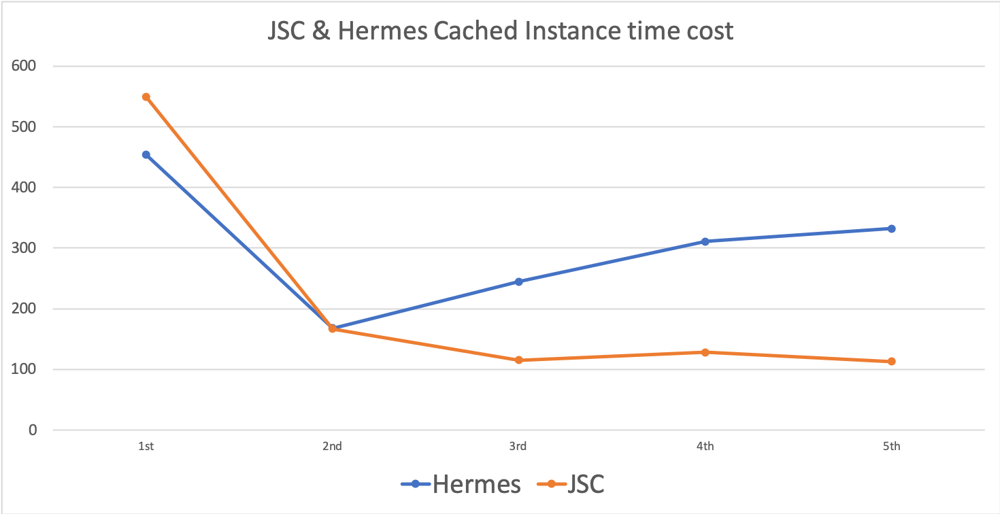

# HermesTestDemo

### Time-consuming comparison between JSC and Hermes (both using cached Instance)

#### ScreenShots
|  JSC   | Hermes  |
|  ----  | ----  |
|   |  |
| 单元格  | 单元格 |

#### chart



### How to run this demo?

#### Run with Hermes
```
# gradle.properties
useHermesEngine=true

# shell
./gradlew installDebug
```

#### Run with JSC
```
# gradle.properties
useHermesEngine=false

# shell
./gradlew installDebug
```
